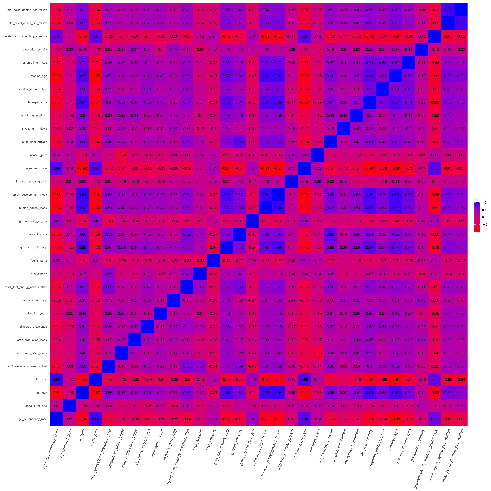

```{r setup, include=FALSE}
knitr::opts_chunk$set(
    echo = TRUE,
    collapse = TRUE,
    comment = '#>',
    fig.path = './figures/'
)
```

```{r, echo=FALSE, warning=FALSE, message=FALSE, results='hide'}
# importing the data and libraries
library(dplyr)
library(ggplot2)
library(knitr)
library(caret)
library(MASS)
library(ggfortify)
library(ggResidpanel)
library(stringr)
library(leaps)
library(olsrr)

df <- read.csv('./data/data.csv')
df <- df %>% dplyr::select(c('birth_rate','life_expectancy',
            'exports_perc_gdp','education_years','gdp_per_capita_ppp','infant_mort_rate',
            'inflation_perc', 'consumer_price_index', 'crop_production_index',
            'goods_imports', 'prevalence_of_anemia_pregnancy', 'diabetes_prevalence',
            'human_capital_index', 'net_enrollment_rate', 'measles_immunization',
            'co2_emissions_gaseous_fuel', 'fossil_fuel_energy_consumption', 'fuel_exports', 'fuel_imports',
            'investment_inflows', 'investment_outflows',
            'agricultural_land', 'greenhouse_gas_em', 'age_dependency_ratio', 
            'imports_annual_growth', 'int_tourism_arrivals', 'total_covid_cases_per_million',
            'total_covid_deaths_per_million', 'population_density', 'median_age', 'human_development_index', 'ar_tech'))


```

# Dataset of choice

For this project I picked a custom-built dataset obtained from the [World bank Databank](https://databank.worldbank.org/home.aspx), specifically the [World Development Indicators database](https://databank.worldbank.org/source/world-development-indicators). This is the "primary World Bank collection of development indicators" as stated on the database description. It is a database that especifically lists development variables, many of which also are related to health, economics, the environment and human development in a broad sense.

A second helper dataset that I also used and merged with the one obtained through the World Bank is a COVID-19 dataset constructed by [Our World in Data](https://ourworldindata.org/) and obtained from [their GitHub repository](https://github.com/owid/covid-19-data/tree/master/public/data), or directly from [the direct link in the README](https://covid.ourworldindata.org/data/owid-covid-data.csv).

The amount of historical data on both databases is massive, and the amount of possible predictors is immense. I have decided to stick to an amount of variables that is also quite large, but will be very interesting to reduce with the techniques learned in class.

## Variables

I have made a really large selection of variables (over 45) initially, however, as many included NAs and a significant amount of countries and dependencies lacked a large amount of metrics, the amount of columns and countries has been reduced to 38 and 173 respectively. Nonetheless, this is still a reasonable amount of data, and also enough to make a reasonably acceptable prediction.

\large
NOTE:
\normalsize

- **\textcolor{blue}{blue}** = used for training/predicting
- **\textcolor{red}{red}** = target variable
- **\textcolor{green}{green}** = ID variables

Variables in the original dataset as constructed using the World Bank Databank tool and the COVID-19 dataset (all variables were renamed):

- [**year**]{color="green"}: year the data was obtained in
- [**year_code**]{color="green"}: code for the year as the world bank databank sets it
- [**country_name**]{color="green"}: name of the country
- [**country_code**]{color="green"}: alpha-3 ISO 3166 code for the country
- [**access_to_electricity**]{color="red"}: Access to electricity (% of population)
- [**birth_rate**]{color="blue"}: Birth rate, crude (per 1,000 people)
- [**life_expectancy**]{color="blue"}: Life expectancy at birth, total (years)
- [**exports_perc_gdp**]{color="blue"}: Exports of goods and services (% of GDP)
- [**education_years**]{color="blue"}: Compulsory education, duration (years)
- [**gdp_per_capita_ppp**]{color="blue"}: GDP per capita, PPP (current international USD)
- [**perc_internet_users**]{color="red"}: Individuals using the Internet (% of population)
- [**infant_mort_rate**]{color="blue"}: Mortality rate, infant (per 1,000 live births)
- [**inflation_perc**]{color="blue"}: Inflation, consumer prices (annual %)
- [**consumer_price_index**]{color="blue"}: Consumer price index (2010 = 100)
- [**crop_production_index**]{color="blue"}: Crop production index (2014-2016 = 100)
- [**goods_imports**]{color="blue"}: Goods imports (BoP, current USD)
- [**prevalence_of_anemia_pregnancy**]{color="blue"}: Prevalence of anemia among pregnant women (%)
- [**diabetes_prevalence**]{color="blue"}: Diabetes prevalence (% of population ages 20 to 79)
- [**human_capital_index**]{color="blue"}: Human capital index (HCI) (scale 0-1)
- [**net_enrollment_rate**]{color="blue"}: Adjusted net enrollment rate, primary (% of primary school age children)
- [**measles_immunization**]{color="blue"}: Immunization, measles (% of children ages 12-23 months)
- [**co2_emissions_gaseous_fuel**]{color="blue"}: CO2 emissions from gaseous fuel consumption (% of total)
- [**fossil_fuel_energy_consumption**]{color="blue"}: Fossil fuel energy consumption (% of total)
- [**fuel_exports**]{color="blue"}: Fuel exports (% of merchandise exports)
- [**fuel_imports**]{color="blue"}: Fuel imports (% of merchandise imports)
- [**investment_inflows**]{color="blue"}: Foreign direct investment, net inflows (% of GDP)
- [**investment_outflows**]{color="blue"}: Foreign direct investment, net outflows (% of GDP)
- [**mobile_subscriptions**]{color="red"}: Mobile cellular subscriptions (per 100 people)
- [**agricultural_land**]{color="blue"}: Agricultural land (% of land area)
- [**greenhouse_gas_em**]{color="blue"}: Total greenhouse gas emissions (% change from 1990)
- [**age_dependency_ratio**]{color="blue"}: Age dependency ratio (% of working-age population)
- [**imports_annual_growth**]{color="blue"}: Imports of goods and services (annual % growth)
- [**int_tourism_arrivals**]{color="blue"}: International tourism, number of arrivals
- [**total_covid_cases_per_million**]{color="blue"}: Total COVID-19 cases per 1 million inhabitants
- [**total_covid_deaths_per_million**]{color="blue"}: Total COVID-19 deaths per 1 million inhabitants
- [**population_density**]{color="blue"}: Population density
- [**median_age**]{color="blue"}: Median Age
- [**human_development_index**]{color="blue"}: Human Development Index (HDI, scale 0-1) 
- [**ar_tech**]{color="red"}: Access to and reliance on technology (scale 0-1)

\newpage

### The target variable

From a very roughly inferential standpoint and looking at the data, we can somewhat see that clearly, both developed and developing countries were hit very hard. However, there's a pattern, where a large chunk of developing countries have barely felt the effects of the pandemic (either due to isolation or the fact that there's just other more serious issues, like large-scale wars or poverty).

Mixing development metrics and COVID data might help us see whether COVID data does indeed contribute to this, and also, how well it can perform when compared to those development metrics when it comes to predicting a particularly good metric to assess development of a nation.

In my statistical learning project, I predicted the HDI Group of a country based on many of these development metrics (and a few other differing ones). One of those metrics, and one that was particularly good at assessing a country's development were **access_to_electricity**: percentage of population with access to electricity,**perc_internet_users**: percentage of population which use the internet and **mobile_subscriptions**: mobile cellular subscriptions per 100 people.

These three were incredibly good at predicting HDI and could be a fantastic substitute for it. And reasonably so, we know that the more developed a country is, the more modern its infrastructure for electricity distribution is and the more it eventually relies on the internet to perform certain acitivities.

Having lived in both a developing and developed country myself, I can say that the consistency of services like electricity supply and how common the internet was used to provide services to the population (to internet users) is quite significant.

Therefore, either of these could be used as target variable, but, as this would be somewhat repetitive, I've decided to create a weighted metric to contain all three of them. This metric will be called: **ar_tech**.

This measure will represent the following: *"Access to and reliance on technology"*, or *ART* for short.

The measure will be calculated as a weighted measure as follows:
$$\texttt{ar\_tech} = \frac{\texttt{mobile\_subscriptions} * 10 + \texttt{perc\_internet\_users} * 35 + \texttt{access\_to\_electricity} * 55}{100}$$

This highlights the importance of electricity, as none of the other two would be possible without it, and that clearly, electricity is significantly more important than use of the internet or mobile subscriptions. However, more people using the internet is a huge sign of development, this is also true for mobile subscriptions, but perhaps to a lesser extent.

# Data preprocessing

The data cleanup and very basic feature selection (only removing those with too many NAs) was performed in Python. Then a small imputation was then performed in R (only for 5 remaining missing values) within the same Jupyter Notebook (called *preprocessing.ipynb*).

## Methodology and steps

\begin{enumerate}
  \item Prior to importing the data, I performed a find and replace within the .csv file with the following regex: \begin{verbatim} \s\[[\w\S]{1,}\] \end{verbatim} to remove every instance of it. This regex matches a metadata tag that the world bank uses in their dataset. Following this step, the data was imported.

  \item Metadata at the end of the dataset was removed. This data corresponded with indexes and regions, whereas the rest of the dataset corresponded with data specific to the countries conforming these indexes/regions. We only keep the countries.

  \item The year column was converted to integer and the '..' values (which represent NAs in the World bank databank) were replaced for numpy NaNs and then the values were sorted by year and country name.

  \item Data missing in later years (2021, 2020) was backfilled with data from previous years (2000-2019), as it still fits our modelling purposes, many of the backfilled data points still correspond to metrics that fit our criteria. The oldest possible data point would go as far back as the year 2000, however, it's unlikely we should have data this old, most should have been backfilled.

  \item The dataset which contains the COVID-19 cases, deaths, population density, population, median age, etc.. is imported, we make a short variable selection within it, only keeping values which correspond to May 1st, 2021. Then, we merge this dataset with the previous dataset utilizing ISO code and using an inner join, only keeping countries in common in both datasets.

  \item Columns with more than 45 NA values were removed as this represents around 25% of the countries in question.

  \item Numerical columns were converted into floats and column names were simplified for easier future manipulation and to call the column names in a more practical way.

  \item We take the \textbf{mobile\_subscriptions} variable, and convert it to a percentage of the population, in this case, we leave it in ratio form and do not multiply by 100, as we prefer a 0-1 scale.
  
  \item The categorical target variable is constructed as explained previously to this step.

  \item The data is then exported as a csv (the dataset itself, called \textit{data.csv}), along with a json (\textit{columns.json}) file which contains the renaming used for the columns in the originally preprocessed dataset up to that step.

  \item The data is then imported in an R cell and a \textit{mice} imputation is performed using the 'cart' method with m = 5 in order to impute the very few missing values remaining (about 5 missing values).
\end{enumerate}

\newpage

# Exploratory Data Analysis

## Correlation

Here we obtain the correlation matrix maximized per correlation coefficient (using all three: Kendall, Pearson and Spearman) for our dataset.

```{r, echo=FALSE, warning=FALSE, message=FALSE, eval=FALSE, fig.show='hide'}
cols <- names(df)
methods = c('kendall','spearman','pearson')
corr_mat = matrix(rep(0,(length(cols)^2)*4), nrow=length(cols)^2)
corr_mat = corr_mat %>% data.frame() %>% setNames(c('var1','var2','coef','corr_type'))
cnt = 0
for (i in 1:length(cols)) {
    for (j in 1:length(cols)) {
        cnt = cnt + 1
        comb1 <- df %>% dplyr::select(cols[i])
        comb2 <- df %>% dplyr::select(cols[j])
        maximum_cor = 0
        method_used = ''
        for (method in methods) {
            correl <- cor(comb1[,1],comb2[,1], method=method)
            if (abs(correl) > abs(maximum_cor)) {
                maximum_cor <- correl
                method_used = method
            }
        }
        corr_mat$coef[cnt] = maximum_cor
        corr_mat$var1[cnt] = cols[i]
        corr_mat$var2[cnt] = cols[j]
        corr_mat$corr_type[cnt] = method_used
    }
}

#plotting the matrix
corr_mat %>% ggplot(aes(var1, var2, fill=coef)) +
                 geom_tile() +
                 geom_text(aes(label=round(coef,2))) +
                 scale_fill_gradient(low="red", high="blue", limits=c(-1,1))+
                 theme( axis.text.x = element_text(angle = 70, vjust = 1, size = 12, hjust = 1),
                        axis.title.x = element_blank(),
                        axis.title.y = element_blank(),
                        panel.grid.major = element_blank(),
                        panel.border = element_blank(),
                        panel.background = element_blank(),
                        axis.ticks = element_blank()) +
                ggsave(file='./img/correl_heatmap.png',  width = 20, height = 20)
```

{width=50%}

There's several things we can notice here that could prelimarily tell us how some of these variables could be excellent predictors.

The most relevant values to compare with our target variable are:

### Very high correlation

#### Negative

- *age_dependency_ratio*: -0.84
- *birth_rate*: -0.87
- *infant_mort_rate*: -0.92
- *prevalence_of_anemia_pregnancy*: -0.93

#### Positive

- *gdp_per_capita_ppp*: 0.88
- *human_capital_index*: 0.92
- *human_development_index*: 0.94
- *life_expectancy*: 0.91
- *median_age*: 0.87

All these metrics are clearly all significantly descriptive of how developed a country is, those positive ones tell us that the higher their value, the more developed a country is, and the opposite for the negative ones.

A reasonable hypothesis can be proposed, that our constructed target variable is a reasonably good descriptor of development as a whole. These high correlation variables could be instrumental to our predictions

### Moderately correlated

#### Positive

- *total_covid_cases_per_million* and *total_covid_deaths_per_million* at 0.69 and 0.61 respectively
- *net_enrollment_rate*: 0.72
- *int_tourism_arrivals* and *fossil_fuel_energy_consumption* at 0.66 and 0.65 respectively
- *goods_imports*: 0.68
- *investment_outflows*: 0.6

These moderately correlated variables could also be interesting at predicting, perhaps for better or for worse depending on how we treat them. But it's interesting to see how correlated COVID-19 cases and deaths are to our constructed target index. We could go back to a previous inference we made where we especulated that the most developed and some developing countries were hit the hardest when it comes to the pandemic, while other developing countries, while beign hit hard economically, also handled the pandemic much better than most developed countries.

The rest of the metrics in this category we can infer that are related to each country's development measure as well, but maybe not as much as those previous ones we saw.

### Not correlated almost *at all*

- *agricultural_land*
- *imports_annual_growth*
- *fuel_exports*
- *population_density*
- *inflation_perc*

These variables maybe relate with development, maybe don't, but for the most part, we can't comfortably say they're very significantly related to it.

They will be used, but I suspect these will be the first ones to be ditched by variable selection algorithms or models themselves.

\newpage

# Modelling: statistical tools

Onto the modelling part. We will test several models, simple and robust ones, however, all will be done utilizing 5 repeats of 10-fold cross validation. Defined as follows using the *caret* package:

\small

```{r, echo=TRUE, warning=FALSE, message=FALSE}
ctrl <- trainControl(method = "repeatedcv", 
                     number = 10, repeats = 5)
```

\normalsize

## Simple models

### Simple linear regression (univariate):

We will test simple and multiple regression model for each set of variables, of those that have the highest correlations with our target variable.

#### Prevalence of anemia in pregnancy to predict ART index

Utilizing prevalence of anemia in pregnancy to predict ART index, we obtain an Rsquared of ~0.69 and a relatively low MAE of ~0.099. It's a very simple model, but we can say we're off to a good start. 

##### Results table

\small

```{r, echo=FALSE, warning=FALSE, message=FALSE}
model <- train(ar_tech ~ prevalence_of_anemia_pregnancy ,
           data = df,
           method  = "lm",
           trControl = ctrl)

# create df with r squared
model_results <- data.frame(RMSE=model$results['RMSE'], MAE=model$results['MAE'], Rsquared=model$results['Rsquared'])

# make table pretty
knitr::kable(
    model_results,
    booktabs=TRUE,
    longtable=TRUE,
    caption="ART index ~ Prevalence of anemia in pregnancy"
)
```

\normalsize

#### Infant mortality rate to predict ART index

Testing with a different strongly negatively correlated variable, in this case infant mortality rate, a metric that's usually quite high in countries with low ART index, we can see that the model is reasonably better than that of prevalence of anemia in pregnancy ~ ART index.

We obtain an Rsquared of ~0.79 and a MAE of ~0.079, which is in itself an acceptable model. Perhaps this would be one of those variables that contributes to more robust and multivariate models.

##### Results table

\small

```{r, echo=FALSE, warning=FALSE, message=FALSE}
model <- train(ar_tech ~ infant_mort_rate ,
           data = df,
           method  = "lm",
           trControl = ctrl)

# create df with r squared
model_results <- data.frame(RMSE=model$results['RMSE'], MAE=model$results['MAE'], Rsquared=model$results['Rsquared'])

# make table pretty
knitr::kable(
    model_results,
    booktabs=TRUE,
    longtable=TRUE,
    caption="ART index ~ Infant mortality rate"
)
```

\normalsize

\newpage

#### Human development index to predict ART index

As an analogous index to HDI, it is reasonable to check whether it is acceptable at predicting it in a simple linear regression model. 

And we find that yes!, it's actually quite good, with an Rsquared of ~0.88 and MAE of ~0.06. This variable is probably going to contribute somewhat well in more robust and multiple models.

##### Results table

\small

```{r, echo=FALSE, warning=FALSE, message=FALSE}
model <- train(ar_tech ~ human_development_index ,
           data = df,
           method  = "lm",
           trControl = ctrl)

# create df with r squared
model_results <- data.frame(RMSE=model$results['RMSE'], MAE=model$results['MAE'], Rsquared=model$results['Rsquared'])

# make table pretty
knitr::kable(
    model_results,
    booktabs=TRUE,
    longtable=TRUE,
    caption="ART index ~ HDI"
)
```

\normalsize

 
### Simple linear regression (multivariate):

For multivariate linear regression we first test out with all the variables, utilizing the same trainControl defined as before:

#### Using all variables to predict ART index

Utilizing all the variables yields a reasonably good model.

The Rsquared is of ~0.89 and the MAE is of ~0.061. This is only slightly better than when using only HDI.

##### Results table

\small

```{r, echo=FALSE, warning=FALSE, message=FALSE}
model <- train(ar_tech ~ . ,
           data = df,
           method  = "lm",
           trControl = ctrl)

# create df with r squared
model_results <- data.frame(RMSE=model$results['RMSE'], MAE=model$results['MAE'], Rsquared=model$results['Rsquared'])

# make table pretty
knitr::kable(
    model_results,
    booktabs=TRUE,
    longtable=TRUE,
    caption="ART index ~ ."
)
```

\normalsize

##### Variable importance

As we suspected, we can see that the most important variables are headed by *life expectancy*, *HDI*, and a few others like *diabetes prevalence*, *fuel exports* and *human capital index*. Interestingly, some of these we did not expect to see up here, but seem to yield decent results along with the rest.

```{r, echo=FALSE, warning=FALSE, message=FALSE, fig.width=12, fig.height=5}
plot(varImp(model))
```

From our variable importance plot, we can then test a model where the variable importance only exceeds 25% importance.

\newpage

#### Using only variables with 20%+ importance

We filter the previously shown data used to plot variable importance, and we only keep those with 20% or more importance filtering the table. 

And looking at our results, we can see there's been a reasonable improvement in model quality, these apparently small incremental improvements when we have a very high Rsquared are quite welcome, and as we have done utilizing the following set of variables:

The model yields an Rsquared of ~0.915 and a MAE of ~0.054, both improving on previous model attempts.

Unfortunately, the COVID-19 metrics do not really contribute as much as we had expected before, yielding a quite low variable importance in the previous all variable model.

```{r, echo=FALSE, warning=FALSE, message=FALSE}
important_vars <- c('birth_rate','life_expectancy','gdp_per_capita_ppp','infant_mort_rate',
            'prevalence_of_anemia_pregnancy', 'diabetes_prevalence',
            'human_capital_index', 'fossil_fuel_energy_consumption', 'fuel_exports', 'age_dependency_ratio','int_tourism_arrivals', 'median_age', 'human_development_index')
imp_vars_formula <- formula(str_interp('ar_tech ~ ${paste(important_vars, collapse="+")}'))
```

##### Results table

\small

```{r, echo=FALSE, warning=FALSE, message=FALSE}
model <- train(imp_vars_formula,
           data = df,
           method  = "lm",
           trControl = ctrl)

# create df with r squared
model_results <- data.frame(RMSE=model$results['RMSE'], MAE=model$results['MAE'], Rsquared=model$results['Rsquared'])

# make table pretty
knitr::kable(
    model_results,
    booktabs=TRUE,
    longtable=TRUE,
    caption="ART index ~ 20%+ importance variables from all variable model"
)
```

\normalsize

##### Variable importance

We also want to see variable importance after clearing up variables that are less important, and we see that the top variables remain the same with a few others going down in importance, much less so than in the previous models. 

Before removing these, we want to test a model with all possible interactions, just to determine whether these serve a good purpose in the model.

```{r, echo=FALSE, warning=FALSE, message=FALSE, fig.width=12, fig.height=5}
plot(varImp(model))
```

## Robust linear model

For the robust models, we test out once again with all the variables.

We first perform a train-test split with 75/25 proportions. and then run *rlm* using the previously defined formula with that preliminary variable selection.

```{r, echo=FALSE, warning=FALSE, message=FALSE}
# TT split
in_train <- createDataPartition(df$ar_tech, p = 0.75, list = FALSE)  # 75% for training
training <- df[ in_train,]
testing <- df[-in_train,]
```

Running the model we obtain the following RMSE:

```{r, echo=FALSE, warning=FALSE, message=FALSE, fig.width=10, fig.height=7}
model <- rlm(ar_tech ~ ., data=training)
rlm_pred <- predict(model, newdata = testing)
sqrt(mean((exp(rlm_pred) - testing$ar_tech)^2))
```

Which in an of itself is not a bad metric, but certainly inferior to the previous models, although those had the advantage of cross validation, which might have significantly improved results.

And Rsquared:

```{r, echo=FALSE, warning=FALSE, message=FALSE}
cor(testing$ar_tech, rlm_pred)^2
```

As for the Rsquared we get a quite decent result at ~0.89, somewhat on par with the simple model using only HDI to predict ART index.

### Using OLS model selection to improve on the simple linear model with all vars

#### OLS forward based on p-val

This method yields a model which performs a similar variable selection to that made through the variable importance plot, with the addition of a few other variables, however, it achieves a better model.

The model gives up some AIC points for a lower RMSE and higher Rsquared, yielding a resulting model with an Rsquared of ~0.925 and an RMSE of ~0.0642.

\footnotesize

```{r, echo=FALSE, warning=FALSE, message=FALSE}
slm <- lm(ar_tech ~ ., data=training)
ols_step_forward_p(slm)
```

\normalsize

#### OLS forward based on AIC

Here we get a similar result to the previous one but with a more simplified set of variables. The quality of teh model is very similar if not basically identical with an Rsquared of ~0.9246 and a similar AIC.

\footnotesize

```{r, echo=FALSE, warning=FALSE, message=FALSE}
ols_step_forward_aic(slm)
```

\normalsize

#### OLS step backward based on AIC

On the backward based AIC approach, we end up with a similarly high quality model, only very slightly higher than the previous ones, resulting in an Rsquared of ~0.931 and AIC lower than the previous ones.

\footnotesize

```{r, echo=FALSE, warning=FALSE, message=FALSE}
ols_step_backward_aic(slm)
```

\normalsize

#### OLS stepwise AIC

This approach performs similar to the p-value approach, and results in also a similarly quality model, with an Rsquared of ~0.923 and also a similar AIC, lower than that of the backward model, but similar to the others.

\footnotesize

```{r, echo=FALSE, warning=FALSE, message=FALSE}
ols_step_both_aic(slm)
```

\normalsize

## Advanced Regression models

###


```{bash, echo=FALSE, warning=FALSE, message=FALSE}
# Join PDF with cover page
pdftk "./cover page/portada.pdf" "./report.pdf" cat output "./final_report.pdf"
```

```{bash, echo=FALSE, warning=FALSE, message=FALSE}
# Clean up latex output files (not very useful)
IFS=$'\n'
set -f
for f in $(find ../ -name '*.log' -or -name '*.out' -or -name '*.synctex.gz' -or -name '*.fls' -or -name '*.fdb_latexmk' -or -name '*.aux'); do rm "$f"; done
unset IFS
set +f
```